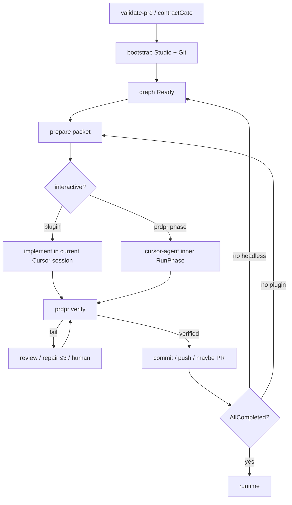

# Current orchestrator flow

**Historical snapshot.** For the canonical implemented flow use [`FLOW.md`](FLOW.md) and [`GRAPH_AND_LOOPS.md`](GRAPH_AND_LOOPS.md).

The notes below were true at an earlier audit and are **corrected** where the engine has since grown.

**Actors:** `[ENGINE]` `[GRAPH]` `[LLM]` `[CURSOR]` `[SHELL]` `[HUMAN]` `[GITHUB]` `[CI]`

**Corrections vs the original snapshot**

- Headless **does** walk remaining READY phases in-process: `Engine.RunGraph` / `prdpr phase`. The plugin still must not call `prdpr phase`; it repeats `prepare` after each verified phase.
- `[GRAPH]` selection refuses non-READY `--phase` (`selectRunnablePhase`). READY bypass is **not** implemented.
- Default LLM adapter is still `llm.None`. Completeness/review skip the network unless an adapter is injected.
- Runtime repair still prepares a packet; `prdpr runtime` is not a fully autonomous inner restart loop.
- After verified success the engine commits by default and attempts push/PR per [GIT_GITHUB.md](GIT_GITHUB.md).

