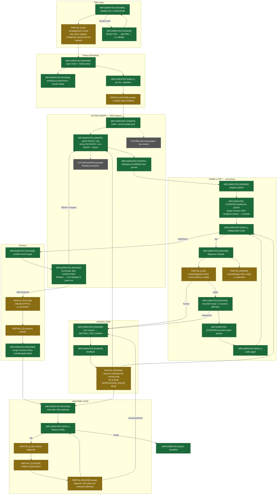

# Graph + loop target flow

**Status:** Target diagram from the graph-loop audit. Canonical current behavior: [`GRAPH_AND_LOOPS.md`](GRAPH_AND_LOOPS.md).

Smallest evolution of the engine so the orchestrator is graph-driven and loop-driven. No new orchestration framework.

Updates since this note was written:

- Outer walk `Engine.RunGraph` / `prdpr phase` is **IMPLEMENTED** (sequential READY).
- READY-only selection (refuse BLOCKED/`--phase` override) is **IMPLEMENTED**.
- RUNNING persist on prepare is **IMPLEMENTED**.
- Completeness still **PARTIAL** (skipped on `llm.None`).
- Upstream rewind still **PARTIAL**.
- Runtime inner restart loop still **PARTIAL**.
- Parallel Ready() and task-level graphs remain **OUT OF SCOPE**.

**Status legend**

- **IMPLEMENTED** — already drives execution
- **PARTIAL** — package or persistence exists; scheduler does not fully own the step
- **FUTURE** — do not build yet unless dogfood proves the need

**Actors:** `[ENGINE]` `[GRAPH]` `[LLM]` `[CURSOR]` `[SHELL]` `[HUMAN]` `[GITHUB]` `[CI]`

## What to wire (smallest set)

Items 1–3 are **done** (`RunGraph` walks READY after COMPLETED). Remaining:

4. `repair.Rewind` + `applyRewind` exist; they need a real upstream origin from diagnose, plus Git checkout of the origin checkpoint — not a new graph store. **PARTIAL**
5. Completeness/placement should always write the same human request files. **PARTIAL** for completeness when LLM is None (skipped)
6. Runtime already has incident + `MaxAttempts`; close the loop by invoking the same repair worker bound as `RunPhase`, without a second scheduler type. **PARTIAL**

## Explicitly out of scope until proven

- Task-level DAG
- Dynamic graph mutation / autonomous rewrite
- Parallel `Ready()` workers
- Subagent spawning (`Decide` stays advisory)
- New graph persistence format
- Multi-agent orchestration
